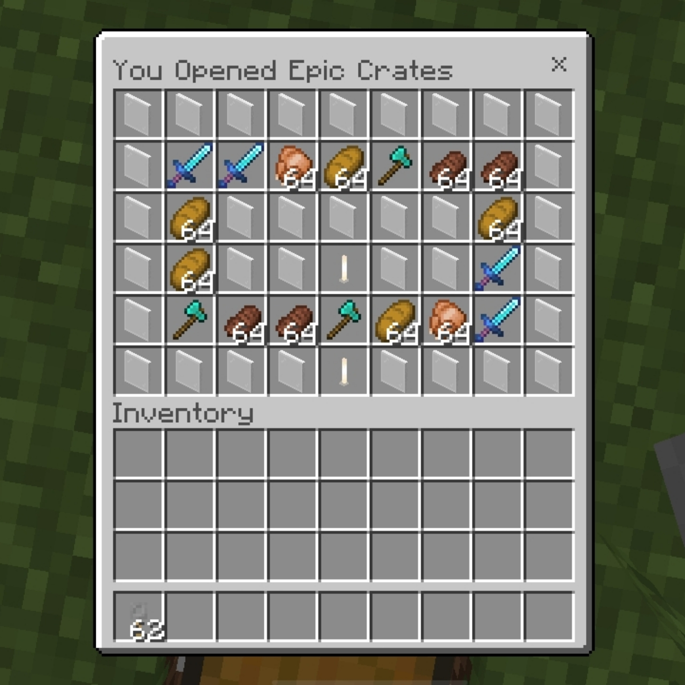
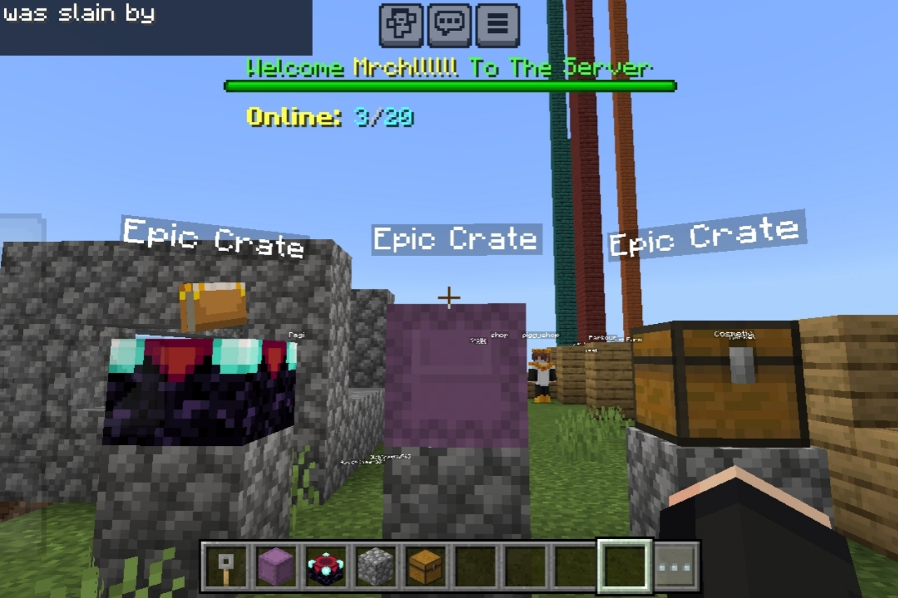
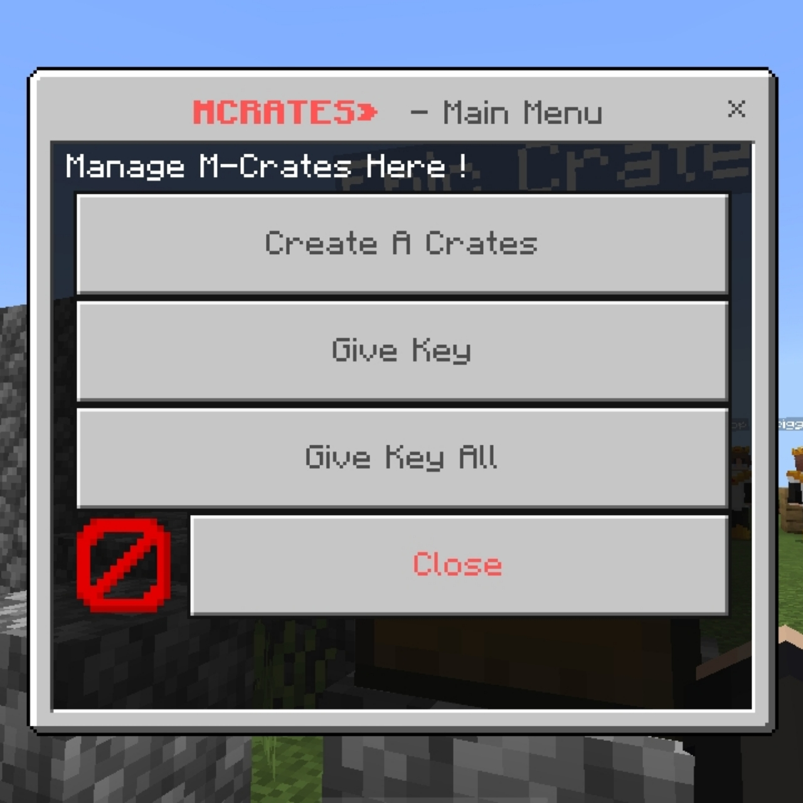

<h2>MCrates</h2>

MCrates is a cloning plugin from PiggyCrates, Make simple and customizable crates plugin, supporting an unlimited amount of crate types. support custom item by Customies?

<h2>Feature:</h2>
<ol>
  <li>PiggyCustomEnchant Support.</li>
  <li>Support More Crate Blocks.</li>
  <li>Unlimited Crate Type</li>
  <li>Support Custom Item by Customies?</li>
  <li>Form Manager</li>
  <li>Easy to use</li>
</ol>

<h2>Depend:</h2>
<ol>
  <li>Commando</li>
  <li>libPiggyUpdateChecker</li>
  <li>InvMenu</li>
  <li>Customies</li>
  <li>FormAPI</li>
</ol>

<h2>Support crate blocks:</h2>
<ol>
  <li>Chest</li>
  <li>EnchantTable</li>
  <li>Shulker(bugs)</li>
  <li>Barrel</li>
  <li>Ender Chest</li>
  <li>Beacon</li>
</ol>

<h2>Screenshot:</h2>

<h2>TODO:</h2>
<ol>
  <li>Add Keyshop feature</li>
</ol>
